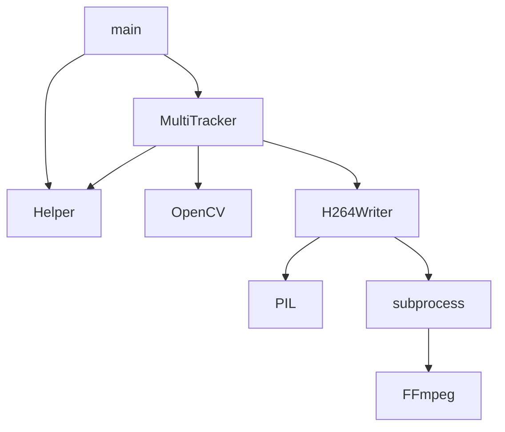

# Object Tracking

_Acá va un párrafo que describa lo que es el proyecto_


## Quick Start Example 🚀

_Estas instrucciones te permitirán obtener una copia del proyecto en funcionamiento en tu máquina local para propósitos de desarrollo y pruebas._

```Bash
git clone https://github.com/paltamura/object_tracking.git
docker-compose up
```

## Custom Example

> **A:** Because you don't want to test the code, you want to test the *program*.

    .
    ├── ...
    ├── data-io
    │   ├── input
    │   │   ├── integration      <- End-to-end, integration tests (alternatively `e2e`)
    │   │   └── input.mkv        <- Unit tests
    │   └── output
    │       └── output.mkv       <- Unit tests
    └── ...

> **B:** Because you don't want to test the code, you want to test the *program*.
```Bash
docker-compose up
```

## Custom Example

> **B:** Use diagram.


> **D:** Because you don't want to test the code, you want to test the *program*.


## Construido con 🛠️

_Menciona las herramientas que utilizaste para crear tu proyecto_

* [Dropwizard](http://www.dropwizard.io/1.0.2/docs/) - El framework web usado
* [Maven](https://maven.apache.org/) - Manejador de dependencias
* [ROME](https://rometools.github.io/rome/) - Usado para generar RSS

## Licencia 📄

Este proyecto está bajo la Licencia (Tu Licencia) - mira el archivo [LICENSE.md](LICENSE.md) para detalles


---
⌨️ con ❤️ por [paltamura](https://github.com/paltamura) 😊


