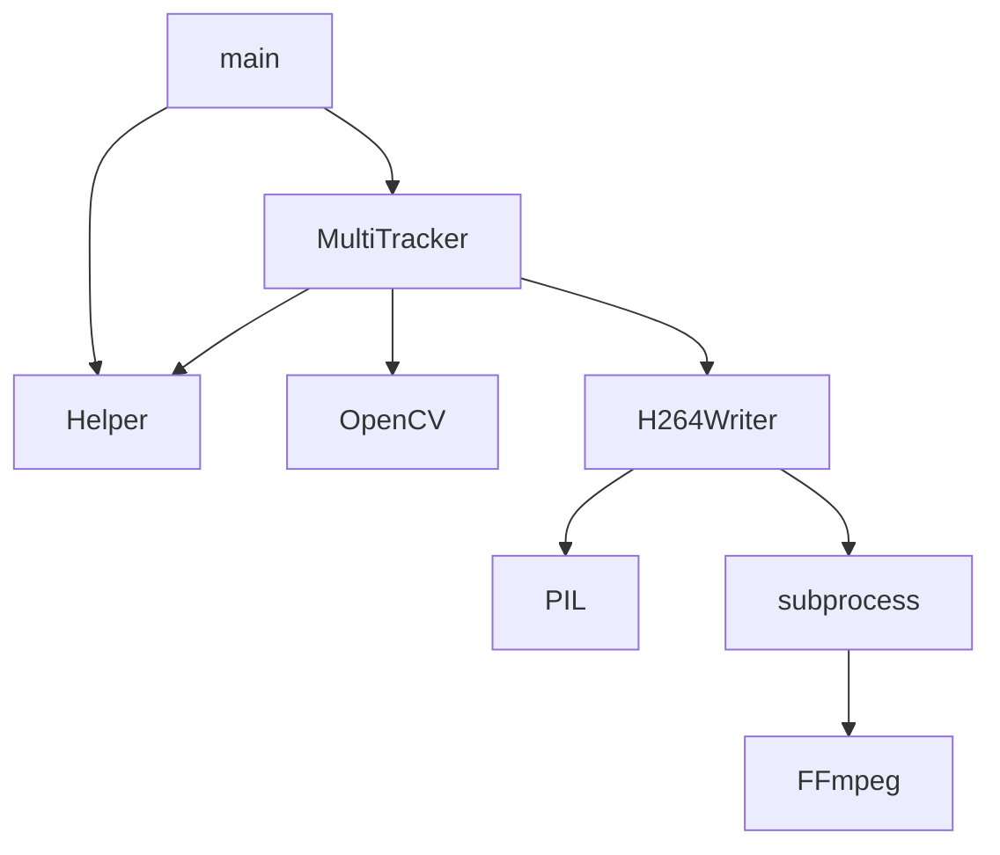

# Título del Proyecto

_Acá va un párrafo que describa lo que es el proyecto_

## Comenzando 🚀

_Estas instrucciones te permitirán obtener una copia del proyecto en funcionamiento en tu máquina local para propósitos de desarrollo y pruebas._

Mira **Deployment** para conocer como desplegar el proyecto.


### Pre-requisitos 📋

_Que cosas necesitas para instalar el software y como instalarlas_

```
Da un ejemplo
```

### Instalación 🔧

_Una serie de ejemplos paso a paso que te dice lo que debes ejecutar para tener un entorno de desarrollo ejecutandose_

_Dí cómo será ese paso_

```
Da un ejemplo
```

_Y repite_

```
hasta finalizar
```

_Finaliza con un ejemplo de cómo obtener datos del sistema o como usarlos para una pequeña demo_

## Ejecutando las pruebas ⚙️

_Explica como ejecutar las pruebas automatizadas para este sistema_

### Analice las pruebas end-to-end 🔩

_Explica que verifican estas pruebas y por qué_

```
Da un ejemplo
```

### Y las pruebas de estilo de codificación ⌨️

_Explica que verifican estas pruebas y por qué_

```
Da un ejemplo
```

## Despliegue 📦

_Agrega notas adicionales sobre como hacer deploy_

## Construido con 🛠️

_Menciona las herramientas que utilizaste para crear tu proyecto_

* [Dropwizard](http://www.dropwizard.io/1.0.2/docs/) - El framework web usado
* [Maven](https://maven.apache.org/) - Manejador de dependencias
* [ROME](https://rometools.github.io/rome/) - Usado para generar RSS

## Contribuyendo 🖇️

Por favor lee el [CONTRIBUTING.md](https://gist.github.com/villanuevand/xxxxxx) para detalles de nuestro código de conducta, y el proceso para enviarnos pull requests.

## Wiki 📖

Puedes encontrar mucho más de cómo utilizar este proyecto en nuestra [Wiki](https://github.com/tu/proyecto/wiki)

## Versionado 📌

Usamos [SemVer](http://semver.org/) para el versionado. Para todas las versiones disponibles, mira los [tags en este repositorio](https://github.com/tu/proyecto/tags).

## Autores ✒️

_Menciona a todos aquellos que ayudaron a levantar el proyecto desde sus inicios_

* **Andrés Villanueva** - *Trabajo Inicial* - [villanuevand](https://github.com/villanuevand)
* **Fulanito Detal** - *Documentación* - [fulanitodetal](#fulanito-de-tal)

También puedes mirar la lista de todos los [contribuyentes](https://github.com/your/project/contributors) quíenes han participado en este proyecto. 

## Licencia 📄

Este proyecto está bajo la Licencia (Tu Licencia) - mira el archivo [LICENSE.md](LICENSE.md) para detalles

## Expresiones de Gratitud 🎁

* Comenta a otros sobre este proyecto 📢
* Invita una cerveza 🍺 o un café ☕ a alguien del equipo. 
* Da las gracias públicamente 🤓.
* etc.


---
⌨️ con ❤️ por [Villanuevand](https://github.com/Villanuevand) 😊


# Object Tracking

```Bash
docker-compose up
```


> **A:** Because you don't want to test the code, you want to test the *program*.

    .
    ├── ...
    ├── data-io                  # Test files (alternatively `spec` or `tests`)
    │   ├── input                # Load and stress tests
    │   │   ├── integration      # End-to-end, integration tests (alternatively `e2e`)
    │   │   └── input.mkv        # Unit tests
    │   └── output               # Unit tests
    │       └── output.mkv       # Unit tests
    └── ...
    


> **B:** Use diagram.


> **C:** Because you don't want to test the code, you want to test the *program*.


> **D:** Because you don't want to test the code, you want to test the *program*.

