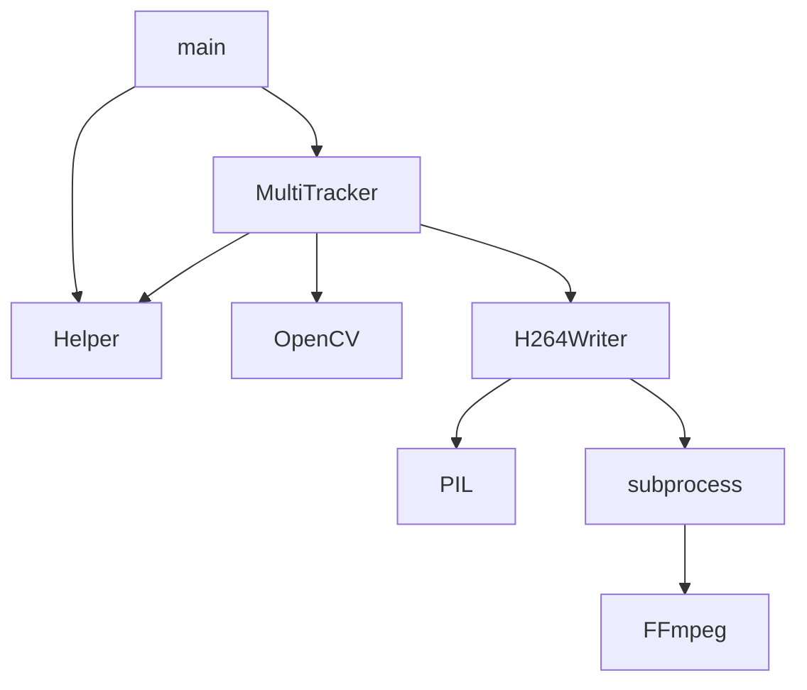

# Object Tracking

A tracking algorithm consists of predicting the position of an object in a given frame knowing the position of said object in the previous frame. In general, in the area of Computer Vision, the position of an object in an image is defined from a rectangle (usually known as a Bounding Box) so that, when the rectangle is drawn on the image, the object is inside. of the rectangle.

This system allows tracking different objects in a video.
The system accepts as input parameters the video, which is going to be processed, and a file in JSON format where the initial state of each of the objects to be tracked is defined.

In the JSON file you will find, among other things, the bounding box of each object in tuple format (x, y, width, height) where x, y represent the coordinates of the pixels in the upper left corner of the bounding box, width y height son is the width and height, in pixels, of the bounding box.
As output, the system generates a video with the data obtained from the tracking. The video shows each frame with the bounding boxes obtained for each of the defined objects.


## Quick Start Example 🚀

_These instructions will allow you to get a working copy of the project on your local machine for development and testing purposes._

```Bash
git clone https://github.com/paltamura/object_tracking.git
docker-compose up
```

## Custom Data Example

> **Step 1:** To test your data, you need to replace the initial_conditions.json and input.mkv files in the input folder with your own files.

    .
    ├── ...
    ├── data-io
    │   ├── input
    │   │   ├── initial_conditions.json   <- replace with your file
    │   │   └── input.mkv                 <- replace with your file
    │   └── output
    │       └── output.mkv                
    └── ...

> **Step 2:** And then run docker-compose again...
```Bash
docker-compose up
```

## Expected results in one frame of video output 


## Development notes 

To solve the main process (object tracking) it was decided to use the ***OpenCV Tracker***, since it meets the expectations of the project.

The input video file is read and converted to frames with the help of ***OpenCV***. After processing it is compressed and persisted using ***FFmpeg*** as a process called from python through ***subprocess***.

All relevant configurations have been identified and added to a configuration file “***configuration.ini***”, which is handled by ***configparser***.

To handle logging it was decided to use the python ***logging module*** directly. The level of verbosity is managed from the configuration file.

To organize the system and python environment prerequisites, the files ***requirements.system.txt*** with the system dependencies and ***requirements.txt*** with the python dependencies were created.

To simplify the deployment, a ***Dockerfile*** was created from where the environment is prepared and the tracking system is executed.

A ***docker-compose.yml*** file was also created in which the construction of the docker image is invoked, and a volume is established for the exchange of files between local and container.

## High level usage diagram



## Built with 🛠️

_Tools used to create this project_
* [OpenCV](https://opencv.org/) - Video processing, object tracking
* [FFmpeg](https://ffmpeg.org/ffmpeg.html) - Compression library
* [openh264](https://github.com/cisco/openh264) - Compression codec
* [Subprocess](https://docs.python.org/3/library/subprocess.html) - Process invoke from python
* [Configparser](https://docs.python.org/3/library/configparser.html#supported-ini-file-structure) - Configuration manager
* [Docker](https://www.docker.com/) - Deploy automation
* [Docker Compose](https://docs.docker.com/compose/) - Deploy automation

## License 📄

This project is licensed under the MIT License - see the file [LICENSE.md](LICENSE.md) for details

---
⌨️ con ❤️ por [paltamura](https://github.com/paltamura) 😊
